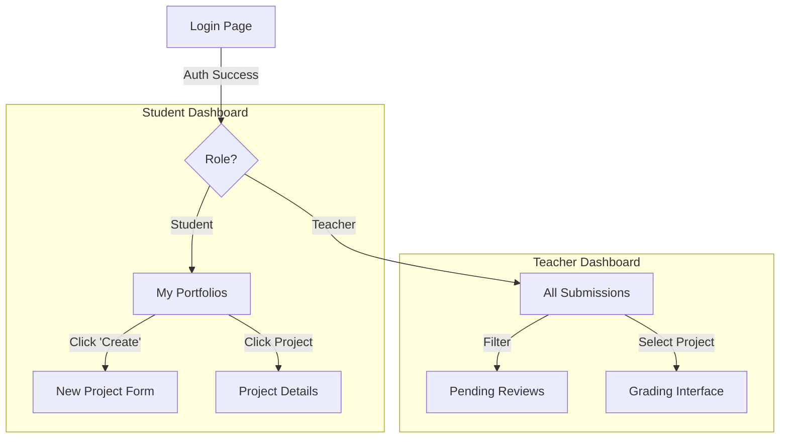

# Design System & Wireframes

## 1. Color Palette & Theme
We are using a **Modern Clean** aesthetic with a focus on readability and accessibility.

### Primary Colors
*   **Indigo-600** (`#4F46E5`): Primary buttons, active states, links.
*   **Slate-900** (`#0F172A`): Primary text, headers, sidebars.

### Secondary Colors
*   **Slate-50** (`#F8FAFC`): Main background.
*   **White** (`#FFFFFF`): Card backgrounds, modal backgrounds.

### Status Colors
*   **Success (Emerald-500)**: Approved portfolios, Passing grades.
*   **Warning (Amber-500)**: Pending reviews.
*   **Error (Red-500)**: Rejected submissions, Delete actions.

## 2. Typography
*   **Font Family**: Inter (Google Fonts) or system-ui.
*   **Scale**:
    *   `h1`: 2.25rem (36px), Bold
    *   `h2`: 1.875rem (30px), Semibold
    *   `body`: 1rem (16px), Regular

## 3. User Journey & Wireframes

### Teacher Flow
1.  **Login Screen**: Simple center card with Email/Password fields.
2.  **Teacher Dashboard**:
    *   **Header**: Logo (Left), User Profile Dropdown (Right).
    *   **Sidebar**: "Dashboard", "Students", "Settings".
    *   **Main Area**:
        *   *Stats Row*: Total Students, Portfolios Pending, Graded.
        *   *Table/Grid*: List of recent portfolio submissions. Columns: Student Name, Title, Date, Status (Badge), Action (View/Grade).

### Student Flow
1.  **Student Dashboard**:
    *   **Header**: Same as Teacher.
    *   **Main Area**:
        *   *My Portfolios*: Grid of card components.
        *   *Create New Button*: Floating Action Button or prominent top-right button.
    *   **Card**: Thumbnail, Title, Description snippet, Status Badge.

### Wireframe Representation (Mermaid)

