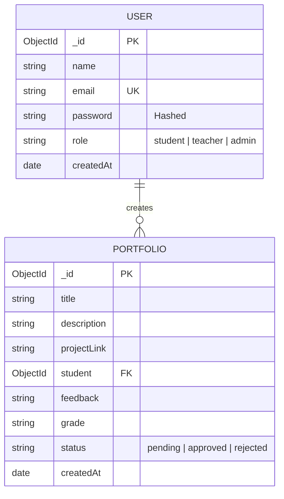

# Student Portfolio System

## 1. Tech Stack & Architecture

### Technology Stack: MERN
We have selected the **MERN Stack** (MongoDB, Express.js, React, Node.js) for the following reasons:
*   **Unified Language**: JavaScript is used throughout the entire application (Client & Server), reducing context switching and simplifying development.
*   **Scalability**: Node.js provides a non-blocking, event-driven architecture suitable for handling concurrent requests (e.g., portfolio updates, real-time feedback).
*   **JSON Native**: MongoDB stores data in BSON (binary JSON), making data flow between the Database, API, and Client seamless.
*   **Reactive UI**: React's component-based architecture ensures a dynamic and responsive user experience for building complex dashboards.

### System Flow Diagram
The following diagram illustrates how the Client, Server, and Database interact:

```mermaid
graph TD
    User((User))
    Client[React Client (Vite + Tailwind)]
    Server[Express API Server]
    DB[(MongoDB Database)]
    Auth[JWT Authentication]

    User -->|Interacts| Client
    Client -->|HTTP Requests (Axios)| Server
    Server -->|Validate Token| Auth
    Server -->|Query/Update| DB
    DB -->|Data| Server
    Server -->|JSON Response| Client
```

---

## 2. Database Schema & Entity Design

### Entities
1.  **User**: Represents Students, Teachers, and Admins.
2.  **Portfolio**: Represents the projects/work submitted by Students.

### ER Diagram



---

## 3. UI/UX & Theme

### Color Palette
*   **Primary**: Indigo-600 (`#4F46E5`) - Action buttons, Links.
*   **Secondary**: Slate-900 (`#0F172A`) - Headings, Navigation.
*   **Background**: Slate-50 (`#F8FAFC`) - Main content area.
*   **Success**: Emerald-500 (`#10B981`) - Approved status.
*   **Warning**: Amber-500 (`#F59E0B`) - Pending status.
*   **Error**: Red-500 (`#EF4444`) - Rejected status / Errors.

### User Journey
1.  **Login/Register**: User authenticates via JWT.
2.  **Dashboard**:
    *   **Student**: View own portfolios, Create new portfolio, See Grades.
    *   **Teacher**: View all student portfolios, Filter by status, Grade/Feedback.
3.  **Portfolio Detail**: View full project details, External links.

---

## 4. GitHub Workflow & Branching Strategy

### Branching Strategy
*   `main`: Production-ready code.
*   `develop`: Integration branch for all new features.
*   `feature/<feature-name>`: Individual feature development (e.g., `feature/auth`, `feature/portfolio-crud`).

### Installation & Setup

#### Prerequisites
*   Node.js (v18+)
*   MongoDB (Local or Atlas)

#### 1. Clone the Repository
\`\`\`bash
git clone <repository-url>
cd student-portfolio-system
\`\`\`

#### 2. Setup Server
\`\`\`bash
cd server
npm install
# Create .env file with:
# PORT=5000
# MONGO_URI=your_mongodb_uri
# JWT_SECRET=your_jwt_secret
npm run dev
\`\`\`

#### 3. Setup Client
\`\`\`bash
cd client
npm install
npm run dev
\`\`\`
